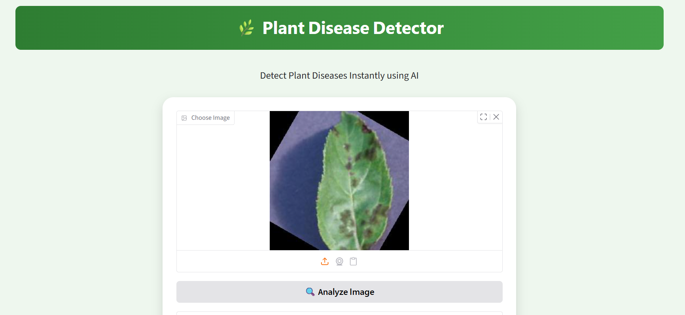
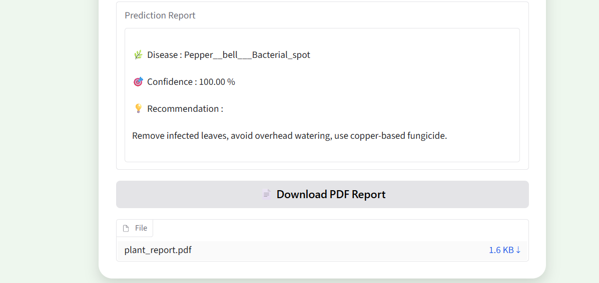

# 🌿 PlantDoc AI Agent

> ### AI-Powered Plant Disease Detection and Recommendation System

<p align="center">


</p>

---

## 🌱 About the Project

PlantDoc AI Agent is an AI-powered web application developed using **TensorFlow**, **Deep Learning**, and **Gradio** to detect plant diseases from leaf images.

The application analyzes an uploaded leaf image, predicts the disease using a trained CNN model, and provides treatment and prevention recommendations through an easy-to-use interface.

This project demonstrates the application of **Artificial Intelligence** in **Smart Agriculture** to support early disease detection and improve crop health.

---

## ✨ Key Features

* 🌿 Plant Disease Detection from Leaf Images
* 🤖 CNN-based Deep Learning Prediction
* 📸 Image Upload Interface
* 💊 Disease Treatment Recommendations
* 🛡️ Prevention Suggestions
* ⚡ Fast Prediction
* 🌐 Live Web Application using Hugging Face Spaces
* 🖥️ User-Friendly Gradio Dashboard

---

## 🛠️ Technology Stack

| Technology         | Purpose              |
| ------------------ | -------------------- |
| Python             | Programming Language |
| TensorFlow / Keras | Deep Learning        |
| Gradio             | Web Interface        |
| NumPy              | Numerical Computing  |
| Pillow (PIL)       | Image Processing     |

---

## 🧠 AI Workflow

```text
Plant Leaf Image
        │
        ▼
Image Preprocessing
        │
        ▼
CNN Model Prediction
        │
        ▼
Disease Identification
        │
        ▼
Treatment & Prevention Recommendations
```

---

## 📸 Application Screenshots

### 🏠 Home Page



### 🔍 Prediction Result



---

## 🚀 Live Demo

**Try the application here:**

👉(https://huggingface.co/spaces/Tanujasridurga/PlantDoc_AI_Agent)

---

## 📂 Repository Structure

```text
PlantDoc_AI_Agent/
│
├── app.py
├── requirements.txt
├── README.md
├── home.png
└── prediction.png
```

---

## ⚙️ Installation

Clone the repository

```bash
git clone https://github.com/tanujasridurgakodavalla18/PlantDoc_AI_Agent.git
```

Go to the project folder

```bash
cd PlantDoc_AI_Agent
```

Install dependencies

```bash
pip install -r requirements.txt
```

Run the application

```bash
python app.py
```

---

## 🎯 Applications

* 🌾 Smart Agriculture
* 🌱 Crop Disease Detection
* 👨‍🌾 Farmer Assistance
* 📚 Agricultural Education
* 🔬 AI Research Projects

---

## 🔮 Future Enhancements

* Support additional plant species
* Mobile application
* Real-time camera detection
* Multi-language recommendations
* AI Chatbot Integration
* Weather-based disease alerts
* Confidence score visualization

---

## 📌 Note

The trained deep learning model is hosted through the Hugging Face deployment. It is not included in this GitHub repository because of GitHub's web upload size limitations for large model files.

---

## 👩‍💻 Author

**Tanuja Sri Durga Kodavalla**

B.Tech – Data Science

---

## 🌟 Support

If you like this project, please consider giving it a ⭐ on GitHub.

It helps others discover the project and supports my work.
